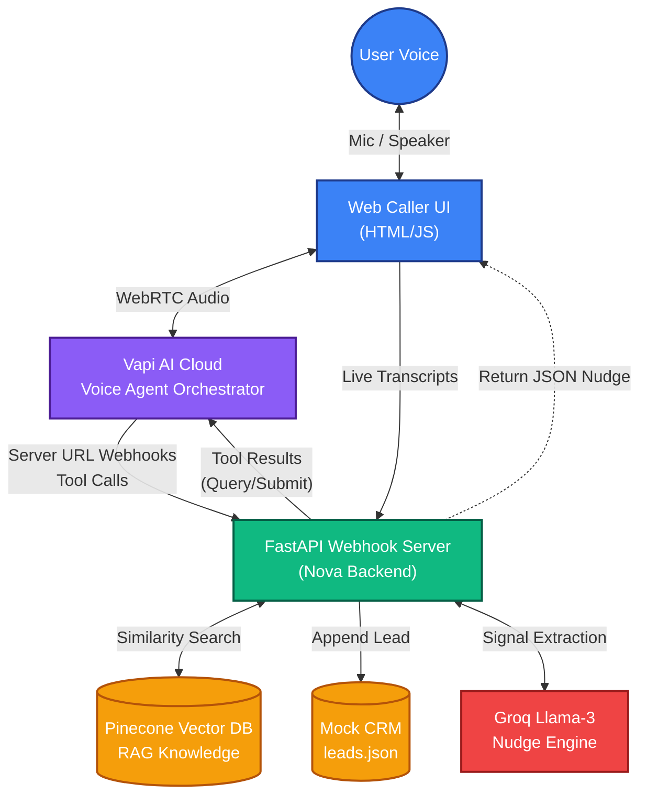

# System Architecture

This document provides a high-level overview of the Nova AI Advisor system architecture, detailing how the Voice Agent, Knowledge Base, and Real-Time Nudge Engine interact.

## High-Level Architecture Diagram

## Key Components

### 1. Frontend Web Caller (`web_caller.html`)
- Built using Vapi's Web SDK.
- Handles WebRTC audio connections with the Vapi Cloud.
- Dynamically intercepts `transcript` and `function-call` events to power the Live Agent Dashboard.
- Submits live transcripts to the Nudge Engine.

### 2. Vapi AI Orchestrator
- Handles Speech-to-Text (ASR) via Deepgram Nova-2.
- Handles LLM planning and dialogue generation.
- Handles Text-to-Speech (TTS) via ElevenLabs and Cartesia.
- Emits Webhook requests to our FastAPI server whenever the AI decides it needs to use a tool.

### 3. FastAPI Backend (`server.py`)
- **`POST /webhook/vapi`**: The core bridge. It catches tool calls from Vapi, routes them to local Python functions (`execute_query_knowledge_base`, `execute_submit_lead_to_crm`), and returns the results.
- **`POST /api/analyze_transcript`**: The Nudge Engine endpoint. Receives transcript buffers from the frontend.

### 4. Knowledge Base (`pinecone`)
- Populated by `cleaner.py` and `indexer.py`.
- Stores strictly curated, public-domain health and multifinance policies encoded into dense vectors using `all-MiniLM-L6-v2`.

### 5. Groq Nudge Engine (`nudge_engine.py`)
- Powered by `llama-3.3-70b-versatile` for ultra-low latency (< 600ms).
- Semantically extracts business signals (frustration, cross-sell, compliance) from a sliding conversation window without relying on brittle Regex rules.
