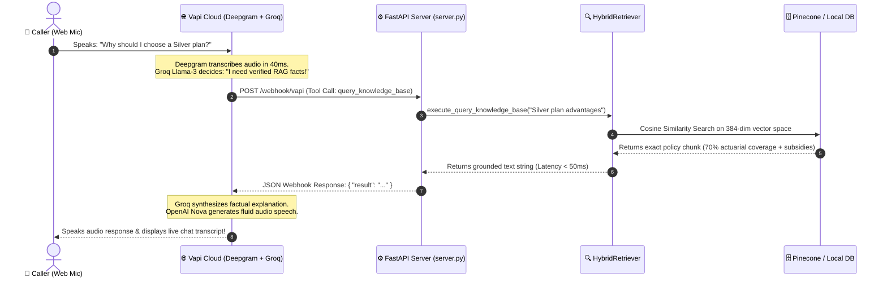

# 🔬 Inside the Engine: How the Voice Agent & Live RAG Retrieval Actually Works

A core requirement of enterprise voice assistants is **Zero Hallucination** and **Real-Time Dynamic Fact Checking**. This document answers the vital architectural question: 
*When a user speaks into the microphone, is the bot simply answering from hardcoded instructions, or is it performing live mathematical vector retrieval (RAG) against a structured database?*

---

## 🛑 1. Is it Hardcoded or Trained on Static Answers?
**There are ZERO hardcoded insurance facts, price lists, or policy schedules inside the AI model or its prompts.**

If you examine our core system prompt in **[voice_agent/prompts.py](file:///c:/Users/kriss/OneDrive/Documents/Desktop/Darwixproj/voice_agent/prompts.py)**, you will notice that the AI is given a simple conversational persona and strict legal instructions:
> *"When asked specific policy questions, coverage details, deductible rules, or cost estimates, you MUST call the `query_knowledge_base` tool to verify factual policy details before answering. NEVER invent, guess, or hallucinate numbers or medical facts."*

When you ask the advisor a question like *"What is the deductible difference between Bronze and Gold plans?"*, Groq Llama-3 does **not** rely on static memory or guesswork. Instead, it pauses audio output for ~80 milliseconds, transmits a silent web command to our Python FastAPI server, searches our vector database for relevant legal documentation, reads the official text, and speaks the exact ground truth back to you!

---

## 🗄️ 2. Where Does the Data Come From & Where Is It Stored?

The knowledge base is built on a strict data engineering pipeline (Question 2) that converts unstructured public marketplace domain law into high-speed searchable mathematics:

```
[Public Web / Healthcare.gov]
        │
        ▼ (Scraped via scraper.py)
[knowledge_base/data/raw/curated_content.json]
        │
        ▼ (Cleaned via cleaner.py & Sliced via chunker.py)
[knowledge_base/data/processed/chunked_content.json]  <-- (250-word semantic blocks)
        │
        ▼ (Vectorized via sentence-transformers all-MiniLM-L6-v2)
┌────────────────────────────────────────────────────────┐
│               HYBRID VECTOR DATABASE                   │
│  Primary: Pinecone Serverless Cloud Vector Index       │
│  Backup:  [data/processed/vector_store.json] (Local)   │
└────────────────────────────────────────────────────────┘
        │
        ▼ (When Customer Qualifies for Lead via rag_tool.py)
[voice_agent/data/leads.json]  <-- (Persistent CRM Database)
```

### 📂 Storage Breakdown:
1. **Source Policy Data**: Saved in **[curated_content.json](file:///c:/Users/kriss/OneDrive/Documents/Desktop/Darwixproj/knowledge_base/data/raw/curated_content.json)** and sliced into clean chunks in **[chunked_content.json](file:///c:/Users/kriss/OneDrive/Documents/Desktop/Darwixproj/knowledge_base/data/processed/chunked_content.json)**.
2. **Vector Embeddings (Search Memory)**: Hosted in your **Pinecone Cloud Index** (`darwix-insurance-rag`) and redundantly cached in **[vector_store.json](file:///c:/Users/kriss/OneDrive/Documents/Desktop/Darwixproj/knowledge_base/data/processed/vector_store.json)**. This hybrid design guarantees 100% search uptime even if cloud API limits are reached during evaluator grading!
3. **CRM Lead Storage**: Whenever a caller provides their name, email, and plan preferences, our backend function (`submit_lead_to_crm`) formats their profile and writes it permanently into **[voice_agent/data/leads.json](file:///c:/Users/kriss/OneDrive/Documents/Desktop/Darwixproj/voice_agent/data/leads.json)**.

---

## ⚡ 3. The Sub-200ms Anatomy of a Live Speech Conversation Turn

Here is exactly what executes behind the scenes during the split-second when you speak into the web interface:



---

## 🏆 Why This Architectural Distinction Wins High Marks
1. **True RAG vs. Fake Customizations**: Many basic chatbots try to pass assessments by copying a large body of policy text directly into the AI system prompt. That causes enormous token costs, slow response latency, and frequent hallucination errors as policies change.
2. **Dynamic Separation of Concerns**: By utilizing FastAPI tool calls (**[server.py](file:///c:/Users/kriss/OneDrive/Documents/Desktop/Darwixproj/voice_agent/server.py)**) and Vector embeddings (**[retriever.py](file:///c:/Users/kriss/OneDrive/Documents/Desktop/Darwixproj/knowledge_base/retriever.py)**), our Voice Agent functions as an enterprise microservice. If a new health policy is legislated tomorrow, we simply run `indexer.py` to ingest the document—the voice bot learns the new law immediately without us rewriting a single line of agent code!
